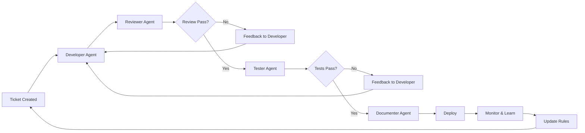
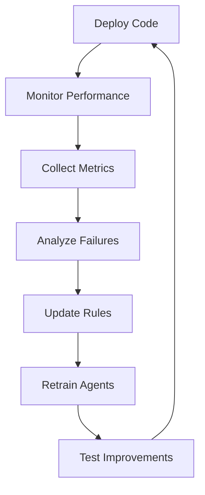

# AI-Driven Development Workflow: Comprehensive Implementation Guide

## Executive Summary

This guide presents a revolutionary approach to software development using AI agents and automation to achieve unprecedented speed and quality. The methodology transforms traditional development cycles from months to days while maintaining or exceeding enterprise-grade quality standards. By treating every aspect of development as AI-manageable entities and implementing robust feedback loops, teams can achieve 10-100x productivity improvements.

## Table of Contents

1. [Core Philosophy](#core-philosophy)
2. [System Architecture](#system-architecture)
3. [Implementation Strategy](#implementation-strategy)
4. [Workflow Automation](#workflow-automation)
5. [Documentation Framework](#documentation-framework)
6. [Quality Assurance](#quality-assurance)
7. [Tools and Technologies](#tools-and-technologies)
8. [Metrics and Measurement](#metrics-and-measurement)
9. [Business Value](#business-value)
10. [Common Challenges](#common-challenges)
11. [Best Practices](#best-practices)
12. [Getting Started](#getting-started)

## Core Philosophy

### Fundamental Principles

1. **Everything is AI**: Treat projects, tickets, documentation, and code as AI-manageable entities
2. **Documentation First**: Clear documentation is the foundation for AI effectiveness
3. **Rapid Iteration**: Focus on creating the fastest possible cycle from idea to production
4. **Continuous Feedback**: Multiple review loops ensure quality and continuous improvement
5. **Automation Over Manual**: Automate everything that doesn't require human judgment

### Key Insight

> "What you're developing is a whole process flow of a digital AI development engineering company... You're creating better than even the best-generated software, because all those cycles are being automated, and everything is feeding back upon on top of each other. That force is so strong."

## System Architecture

### Three-Tier Hierarchy

```
┌─────────────────────────────────────┐
│           RULES                     │
│   (Methodology & Workflows)         │
└─────────────────────────────────────┘
                ▼
┌─────────────────────────────────────┐
│      PROJECT DEFINITION             │
│   (Specifications & Context)        │
└─────────────────────────────────────┘
                ▼
┌─────────────────────────────────────┐
│          TICKETS                    │
│   (Individual Tasks & Changes)      │
└─────────────────────────────────────┘
                ▼
┌─────────────────────────────────────┐
│           CODE                      │
│   (Implementation & Tests)          │
└─────────────────────────────────────┘
```

### Component Descriptions

#### 1. Rules Layer
- **Purpose**: Define how work gets done
- **Contents**: 
  - Development methodologies
  - Workflow definitions
  - Quality standards
  - Review processes
  - Tool usage guidelines
- **Format**: Markdown files in `/rules` directory
- **Update Frequency**: After each project iteration

#### 2. Project Definition Layer
- **Purpose**: Define what is being built
- **Contents**:
  - Business requirements
  - Technical specifications
  - Mathematical definitions
  - Domain terminology
  - Architecture decisions
- **Format**: Structured markdown with clear sections
- **Update Frequency**: As requirements evolve

#### 3. Tickets Layer
- **Purpose**: Track individual changes and tasks
- **Contents**:
  - Task description
  - Acceptance criteria
  - Related files
  - Conversation history
  - Implementation notes
- **Format**: Ticket system with AI-readable format
- **Update Frequency**: Real-time during development

#### 4. Code Layer
- **Purpose**: Actual implementation
- **Contents**:
  - Source code
  - Unit tests
  - Integration tests
  - Documentation comments
- **Format**: Standard programming languages
- **Update Frequency**: Continuous

## Implementation Strategy

### Phase 1: Foundation (Week 1-2)

#### Step 1: Extract Project Knowledge
```bash
# For existing projects, extract current understanding
1. Generate comprehensive code analysis
2. Document all business logic
3. Create mathematical definitions
4. Map dependencies and relationships
```

#### Step 2: Create Documentation Structure
```
/project-root
├── /docs
│   ├── /definitions      # Mathematical and business definitions
│   ├── /specifications   # Technical specifications
│   ├── /architecture     # System architecture
│   └── /api             # API documentation
├── /rules
│   ├── development.md    # Development workflow rules
│   ├── testing.md        # Testing requirements
│   ├── review.md         # Code review process
│   └── deployment.md     # Deployment procedures
├── /templates
│   ├── ticket.md         # Ticket template
│   ├── documentation.md  # Documentation template
│   └── test.md          # Test case template
└── CLAUDE.md            # AI context and instructions
```

#### Step 3: Define Initial Rules
```markdown
# Example Development Rules

## Commit Standards
- Every commit must include unit tests
- Commit messages follow conventional commits format
- All commits must pass linting and type checking

## Review Process
1. Automated code review by AI
2. Unit test verification
3. Documentation check
4. Manual review for business logic

## Quality Gates
- 100% unit test coverage for critical paths
- Documentation for all public APIs
- No unresolved TODOs in production code
```

### Phase 2: Automation Setup (Week 2-3)

#### Step 1: Implement Agent Workflows

```python
# Example Agent Configuration
agents = {
    "developer": {
        "role": "Implement features from tickets",
        "tools": ["code_generation", "testing", "documentation"],
        "rules": "development.md"
    },
    "reviewer": {
        "role": "Review code changes",
        "tools": ["code_analysis", "test_verification"],
        "rules": "review.md"
    },
    "tester": {
        "role": "Create and run tests",
        "tools": ["test_generation", "test_execution"],
        "rules": "testing.md"
    },
    "documenter": {
        "role": "Maintain documentation",
        "tools": ["doc_generation", "consistency_check"],
        "rules": "documentation.md"
    }
}
```

#### Step 2: Create Feedback Loops



### Phase 3: Optimization (Week 3-4)

#### Step 1: Measure and Refine
- Track cycle times for each workflow
- Identify bottlenecks
- Refine rules based on failures
- Optimize agent prompts

#### Step 2: Implement Advanced Features
- Parallel agent execution
- Automatic error detection and correction
- Predictive task generation
- Cross-project learning

## Workflow Automation

### Standard Development Workflow

```yaml
workflow:
  name: "Feature Development"
  triggers:
    - ticket_created
    - manual_trigger
  
  steps:
    - name: "Analyze Requirements"
      agent: "analyst"
      actions:
        - extract_requirements
        - identify_affected_components
        - generate_test_scenarios
    
    - name: "Create Implementation Plan"
      agent: "architect"
      actions:
        - design_solution
        - identify_dependencies
        - estimate_effort
    
    - name: "Implement Feature"
      agent: "developer"
      actions:
        - generate_code
        - create_unit_tests
        - update_documentation
    
    - name: "Review Implementation"
      agent: "reviewer"
      actions:
        - check_code_quality
        - verify_tests
        - validate_documentation
    
    - name: "Deploy"
      conditions:
        - all_tests_pass
        - review_approved
      actions:
        - build_application
        - run_integration_tests
        - deploy_to_staging
```

### Automated Ticket Processing

```python
class TicketProcessor:
    def process_ticket(self, ticket):
        # 1. Analyze ticket
        context = self.extract_context(ticket)
        
        # 2. Find relevant files
        files = self.find_affected_files(context)
        
        # 3. Generate solution
        solution = self.ai_agent.generate_solution(
            ticket=ticket,
            context=context,
            files=files,
            rules=self.load_rules()
        )
        
        # 4. Implement changes
        changes = self.implement_solution(solution)
        
        # 5. Create tests
        tests = self.generate_tests(changes)
        
        # 6. Document changes
        documentation = self.update_documentation(changes)
        
        # 7. Create PR
        pr = self.create_pull_request(
            changes=changes,
            tests=tests,
            documentation=documentation
        )
        
        return pr
```

## Documentation Framework

### Documentation Principles

1. **Atomic Documentation**: Small, focused documentation blocks
2. **Reference Over Duplication**: Link to existing documentation
3. **AI-Optimized Format**: Structure for easy AI parsing
4. **Version Controlled**: Track all documentation changes
5. **Automated Generation**: Generate from code when possible

### Documentation Structure

```markdown
# Component: UserAuthentication

## Definition
Mathematical and precise definition of the component's purpose and behavior.

## Specifications
- Input: `{username: string, password: string}`
- Output: `{token: string, expiresAt: timestamp}`
- Side Effects: Session creation, audit log entry

## Business Rules
- Passwords must be minimum 8 characters
- Account locks after 5 failed attempts
- Sessions expire after 24 hours

## Technical Implementation
- Uses bcrypt for password hashing
- JWT tokens for session management
- Redis for session storage

## References
- Security Policy: [/docs/security.md#authentication]
- API Specification: [/api/auth.yaml]
- Test Cases: [/tests/auth.spec.ts]
```

### Extracting Documentation from Existing Code

```bash
# Step 1: Analyze existing code
ai_agent analyze --source ./src --output ./docs/extracted

# Step 2: Find contradictions
ai_agent validate --docs ./docs/extracted --code ./src

# Step 3: Resolve conflicts
ai_agent reconcile --interactive

# Step 4: Generate final documentation
ai_agent generate-docs --format markdown --output ./docs
```

## Quality Assurance

### Automated Testing Strategy

#### Test Generation from Specifications
```python
def generate_tests_from_spec(specification):
    """
    Generate comprehensive test suite from specifications,
    not from implementation
    """
    test_suite = []
    
    # Parse specification
    requirements = parse_requirements(specification)
    
    # Generate test cases for each requirement
    for req in requirements:
        test_suite.extend([
            generate_positive_test(req),
            generate_negative_test(req),
            generate_edge_case_test(req)
        ])
    
    # Add integration tests
    test_suite.extend(generate_integration_tests(requirements))
    
    return test_suite
```

#### Quality Metrics
- **Code Coverage**: Minimum 80%, critical paths 100%
- **Documentation Coverage**: 100% for public APIs
- **Test Independence**: Tests based on specs, not implementation
- **Cyclomatic Complexity**: Maximum 10 per function
- **Technical Debt**: Track and address in each iteration

### Continuous Improvement Loop



## Tools and Technologies

### Essential Tools

| Category | Tool | Purpose | Priority |
|----------|------|---------|----------|
| **AI Platforms** | Claude, GPT-4 | Code generation and review | Critical |
| **IDE** | Cursor, VS Code | Development environment | Critical |
| **Version Control** | Git | Code versioning | Critical |
| **Automation** | GitHub Actions, Jenkins | CI/CD pipeline | High |
| **Testing** | Jest, Pytest | Unit testing | High |
| **Documentation** | Markdown, Swagger | API and code docs | High |
| **Monitoring** | Prometheus, Grafana | Performance tracking | Medium |
| **Communication** | Slack, Teams | Team collaboration | Medium |

### AI Agent Setup

#### Using Claude Code
```bash
# Install Claude Code
npm install -g claude-code

# Initialize project
claude-code init --project ./my-project

# Set up agents
claude-code agent create --type developer
claude-code agent create --type reviewer
claude-code agent create --type tester

# Configure workflows
claude-code workflow create --template standard-dev
```

#### Using Cursor
```bash
# Configure Cursor for AI development
cursor config set ai.model "claude-3-opus"
cursor config set ai.context.size "200000"
cursor config set ai.rules.path "./rules"
```

### MCP (Model Context Protocol) Integration

```json
{
  "mcp_config": {
    "agents": [
      {
        "name": "database_expert",
        "context": ["./docs/database", "./schemas"],
        "tools": ["sql_generation", "schema_validation"]
      },
      {
        "name": "api_developer",
        "context": ["./docs/api", "./src/api"],
        "tools": ["endpoint_generation", "swagger_docs"]
      }
    ]
  }
}
```

## Metrics and Measurement

### Key Performance Indicators

#### Development Velocity
- **Cycle Time**: Idea to production (target: < 1 day for simple features)
- **Deployment Frequency**: Daily or more
- **Lead Time**: Ticket creation to resolution
- **Throughput**: Features delivered per week

#### Quality Metrics
- **Defect Rate**: Bugs per 1000 lines of code
- **Test Coverage**: Percentage of code covered
- **Documentation Completeness**: Percentage documented
- **Code Review Time**: Hours from PR to merge

#### Business Impact
- **Customer Satisfaction**: Based on delivered features
- **Time to Market**: Reduction percentage
- **Development Cost**: Cost per feature
- **ROI**: Return on AI investment

### Tracking Implementation

```python
class MetricsCollector:
    def __init__(self):
        self.metrics = {
            'cycle_time': [],
            'defect_rate': [],
            'test_coverage': [],
            'documentation_score': []
        }
    
    def track_development_cycle(self, ticket_id):
        start_time = self.get_ticket_creation_time(ticket_id)
        end_time = self.get_deployment_time(ticket_id)
        cycle_time = end_time - start_time
        
        self.metrics['cycle_time'].append({
            'ticket_id': ticket_id,
            'duration': cycle_time,
            'timestamp': datetime.now()
        })
        
        # Alert if cycle time exceeds threshold
        if cycle_time > timedelta(days=2):
            self.alert_team(f"Long cycle time for {ticket_id}")
    
    def generate_report(self):
        return {
            'average_cycle_time': self.calculate_average('cycle_time'),
            'defect_trend': self.calculate_trend('defect_rate'),
            'coverage_improvement': self.calculate_improvement('test_coverage')
        }
```

## Business Value

### Quantifiable Benefits

#### Cost Reduction
- **Development Time**: 10-100x faster delivery
- **Bug Fixing**: 90% reduction in production bugs
- **Documentation**: Automated, saving 20% of dev time
- **Onboarding**: New developers productive in days, not weeks

#### Revenue Impact
- **Time to Market**: Launch features in days instead of months
- **Customer Satisfaction**: Faster bug resolution and feature delivery
- **Scalability**: Handle more projects with same team
- **Innovation**: More time for creative problem-solving

### Implementation ROI Calculator

```python
def calculate_roi(team_size, average_salary, ai_costs):
    """
    Calculate return on investment for AI implementation
    """
    # Traditional development costs
    traditional_velocity = 10  # features per month
    traditional_cost_per_feature = (team_size * average_salary) / traditional_velocity
    
    # AI-enhanced development
    ai_velocity = 100  # 10x improvement
    ai_cost_per_feature = ((team_size * average_salary) + ai_costs) / ai_velocity
    
    # ROI calculation
    savings_per_feature = traditional_cost_per_feature - ai_cost_per_feature
    monthly_savings = savings_per_feature * ai_velocity
    roi_percentage = (monthly_savings / ai_costs) * 100
    
    return {
        'savings_per_feature': savings_per_feature,
        'monthly_savings': monthly_savings,
        'roi_percentage': roi_percentage,
        'payback_period_days': 30 / (roi_percentage / 100)
    }
```

### Monetization Strategies

1. **Consulting Services**: Teach other companies the methodology
2. **Rapid Prototyping**: Build MVPs in days for clients
3. **Automation Tools**: Package workflows as SaaS products
4. **Training Programs**: Courses on AI-driven development
5. **Custom Solutions**: Tailored AI agents for specific industries

## Common Challenges

### Challenge 1: Context Management

**Problem**: AI agents losing context in long conversations

**Solution**:
```python
class ContextManager:
    def __init__(self, max_tokens=100000):
        self.max_tokens = max_tokens
        self.context_store = {}
    
    def manage_context(self, conversation_id):
        # Store conversation summaries
        summary = self.summarize_conversation(conversation_id)
        self.context_store[conversation_id] = summary
        
        # Create new conversation with summary
        new_conversation = self.create_conversation(
            previous_summary=summary,
            relevant_files=self.get_relevant_files(),
            rules=self.get_applicable_rules()
        )
        
        return new_conversation
```

### Challenge 2: Consistency Across Agents

**Problem**: Different agents producing inconsistent outputs

**Solution**:
- Centralized rule management
- Shared templates and examples
- Regular synchronization meetings
- Automated consistency checks

### Challenge 3: Legacy Code Migration

**Problem**: Existing code lacks documentation and tests

**Solution**:
1. Extract business logic through analysis
2. Generate documentation from code behavior
3. Create tests based on current functionality
4. Gradually refactor with AI assistance
5. Validate against production behavior

### Challenge 4: Team Resistance

**Problem**: Developers skeptical of AI tools

**Solution**:
- Start with volunteers
- Show concrete benefits (time saved)
- Provide training and support
- Share success stories
- Make adoption gradual

## Best Practices

### 1. Documentation Standards

```markdown
# Documentation Best Practices

## Format
- Use consistent markdown structure
- Keep sections under 500 words
- Include code examples
- Link to related documentation

## Content
- Define terms precisely
- Avoid ambiguity
- Include acceptance criteria
- Document edge cases

## Maintenance
- Review after each sprint
- Update with code changes
- Version all documentation
- Track documentation debt
```

### 2. Agent Communication

```python
# Clear, structured prompts for agents
class AgentPrompt:
    def __init__(self):
        self.template = """
        CONTEXT: {context}
        TASK: {task}
        CONSTRAINTS: {constraints}
        OUTPUT FORMAT: {format}
        EXAMPLES: {examples}
        """
    
    def create_prompt(self, **kwargs):
        return self.template.format(**kwargs)
```

### 3. Review Process

```yaml
review_checklist:
  automated:
    - syntax_check
    - type_checking
    - unit_tests
    - integration_tests
    - documentation_coverage
    - security_scan
  
  manual:
    - business_logic_validation
    - performance_review
    - user_experience_check
    - accessibility_compliance
```

### 4. Continuous Learning

- Weekly retrospectives on AI performance
- Monthly rule updates based on learnings
- Quarterly methodology reviews
- Annual tool evaluation

## Getting Started

### Week 1: Setup and Learning

**Day 1-2: Tool Installation**
```bash
# Install required tools
npm install -g claude-code cursor
pip install ai-workflow-manager

# Set up development environment
git clone https://github.com/your-org/ai-dev-template
cd ai-dev-template
./setup.sh
```

**Day 3-4: Create Initial Documentation**
- Extract existing project knowledge
- Define initial rules
- Set up documentation structure

**Day 5: Configure First Agent**
```python
# Simple ticket processor
from ai_workflow import Agent

agent = Agent(
    name="ticket_processor",
    model="claude-3",
    rules="./rules/development.md",
    context="./docs"
)

# Process first ticket
result = agent.process_ticket("TICKET-001")
```

### Week 2: Implementation

**Day 1-3: Automate Core Workflow**
- Set up ticket to code pipeline
- Implement automated testing
- Configure deployment automation

**Day 4-5: Add Review Processes**
- Implement code review agent
- Set up quality gates
- Create feedback mechanisms

### Week 3: Optimization

**Day 1-2: Measure Performance**
- Track cycle times
- Identify bottlenecks
- Collect quality metrics

**Day 3-5: Refine and Scale**
- Update rules based on learnings
- Add parallel processing
- Implement advanced features

### Week 4: Production Ready

**Day 1-2: Documentation and Training**
- Complete all documentation
- Create training materials
- Prepare team onboarding

**Day 3-5: Launch and Monitor**
- Deploy to production
- Monitor performance
- Collect feedback
- Plan next iteration

## Advanced Techniques

### Multi-Agent Orchestration

```python
class AgentOrchestrator:
    def __init__(self):
        self.agents = {}
        self.workflows = {}
    
    def register_agent(self, agent):
        self.agents[agent.name] = agent
    
    def execute_workflow(self, workflow_name, input_data):
        workflow = self.workflows[workflow_name]
        results = {}
        
        for step in workflow.steps:
            if step.parallel:
                # Execute parallel steps
                results[step.name] = self.execute_parallel(
                    step.agents,
                    input_data
                )
            else:
                # Execute sequential step
                agent = self.agents[step.agent]
                results[step.name] = agent.execute(
                    input_data,
                    previous_results=results
                )
        
        return results
```

### Context-Aware Rule Selection

```python
class RuleEngine:
    def __init__(self):
        self.rules = self.load_all_rules()
    
    def select_rules(self, context):
        """
        Dynamically select rules based on context
        """
        applicable_rules = []
        
        for rule in self.rules:
            if self.matches_context(rule, context):
                applicable_rules.append(rule)
        
        # Sort by priority
        applicable_rules.sort(key=lambda r: r.priority)
        
        return self.merge_rules(applicable_rules)
```

### Predictive Task Generation

```python
class PredictiveTaskGenerator:
    def analyze_patterns(self, historical_data):
        """
        Analyze historical tickets to predict future tasks
        """
        patterns = self.extract_patterns(historical_data)
        
        predictions = []
        for pattern in patterns:
            if pattern.confidence > 0.8:
                task = self.generate_preventive_task(pattern)
                predictions.append(task)
        
        return predictions
```

## Conclusion

The AI-driven development workflow represents a paradigm shift in software engineering. By treating every aspect of development as an AI-manageable entity and implementing robust feedback loops, teams can achieve unprecedented productivity while maintaining or exceeding quality standards.

### Key Takeaways

1. **Documentation is Power**: Clear, structured documentation enables AI effectiveness
2. **Feedback Loops are Critical**: Continuous improvement through automated feedback
3. **Start Small, Scale Fast**: Begin with simple automations, then expand
4. **Measure Everything**: Data-driven decisions improve outcomes
5. **Embrace Change**: The methodology evolves with each iteration

### Next Steps

1. Choose a pilot project for implementation
2. Set up basic tooling and documentation
3. Create your first automated workflow
4. Measure results and iterate
5. Scale successful patterns across the organization

### Resources

- **GitHub Repository**: [AI-Dev-Workflow-Template](https://github.com/example/ai-dev-workflow)
- **Community Forum**: [AI-Dev-Community](https://forum.ai-dev.example)
- **Training Materials**: [AI-Dev-Training](https://training.ai-dev.example)
- **Consulting Services**: [Contact for enterprise implementation](mailto:consulting@ai-dev.example)

---

*"The future is not about AI replacing developers, but developers who use AI replacing those who don't. This guide shows you how to be on the winning side."*

---

## Appendix A: Sample CLAUDE.md

```markdown
# CLAUDE.md - AI Context for Project

## Project Overview
This is an e-commerce platform built with Next.js and PostgreSQL.

## Key Concepts
- **Order**: A customer purchase containing one or more items
- **Inventory**: Product stock levels managed in real-time
- **Payment**: Processed through Stripe API

## Development Standards
- Use TypeScript for all new code
- Follow ESLint configuration
- Write tests for all business logic
- Document all public APIs

## Current Focus
Working on checkout flow optimization

## Important Files
- `/src/checkout/`: Checkout implementation
- `/tests/checkout/`: Checkout tests
- `/docs/api/checkout.md`: API documentation

## Common Commands
- `npm run dev`: Start development server
- `npm test`: Run test suite
- `npm run lint`: Check code quality
```

## Appendix B: Workflow Examples

### Example 1: Bug Fix Workflow

```yaml
name: bug_fix_workflow
trigger: bug_report

steps:
  - analyze_bug:
      agent: debugger
      actions:
        - reproduce_issue
        - identify_root_cause
        - propose_solution
  
  - implement_fix:
      agent: developer
      actions:
        - create_fix_branch
        - implement_solution
        - add_regression_test
  
  - verify_fix:
      agent: tester
      actions:
        - run_regression_tests
        - verify_bug_resolution
        - check_side_effects
  
  - deploy_fix:
      conditions:
        - all_tests_pass
        - review_approved
      actions:
        - merge_to_main
        - deploy_to_production
        - notify_stakeholders
```

### Example 2: Feature Development Workflow

```yaml
name: feature_development
trigger: feature_request

steps:
  - requirements_analysis:
      agent: analyst
      outputs:
        - user_stories
        - acceptance_criteria
        - technical_requirements
  
  - design_solution:
      agent: architect
      outputs:
        - technical_design
        - api_specification
        - database_changes
  
  - implementation:
      parallel: true
      agents:
        - backend_developer
        - frontend_developer
        - database_developer
  
  - integration:
      agent: integrator
      actions:
        - combine_components
        - resolve_conflicts
        - update_documentation
  
  - testing:
      parallel: true
      agents:
        - unit_tester
        - integration_tester
        - ui_tester
  
  - release:
      agent: release_manager
      actions:
        - create_release_notes
        - deploy_to_staging
        - conduct_uat
        - deploy_to_production
```

## Appendix C: Metrics Dashboard

```python
class MetricsDashboard:
    def __init__(self):
        self.metrics = {}
    
    def display_dashboard(self):
        return {
            "Development Velocity": {
                "Current Sprint": "45 story points",
                "Average": "40 story points",
                "Trend": "↑ 12.5%"
            },
            "Quality Metrics": {
                "Bug Rate": "0.3 per 1000 LOC",
                "Test Coverage": "87%",
                "Documentation": "94%"
            },
            "Cycle Time": {
                "Feature": "2.3 days average",
                "Bug Fix": "4.2 hours average",
                "Documentation": "1.1 days average"
            },
            "AI Performance": {
                "Accuracy": "94%",
                "Automation Rate": "78%",
                "Human Intervention": "22%"
            }
        }
```

---

*This guide is a living document. Update it as you learn and improve your AI-driven development workflow.*